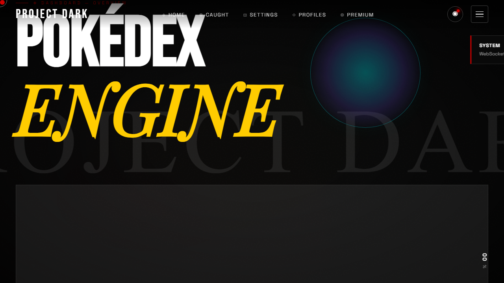
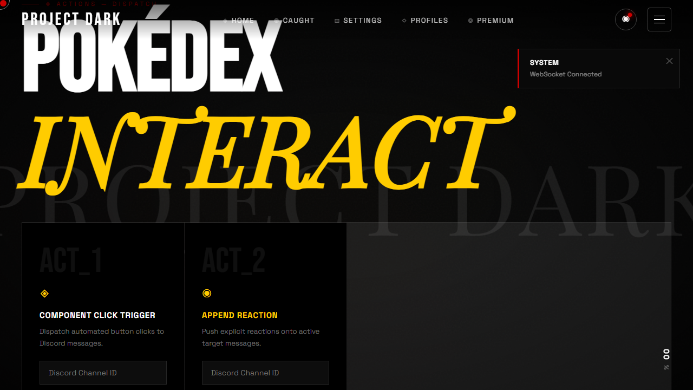
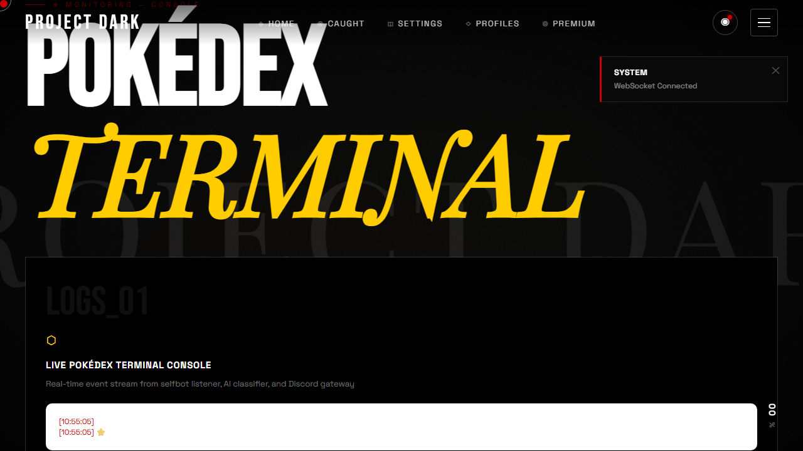
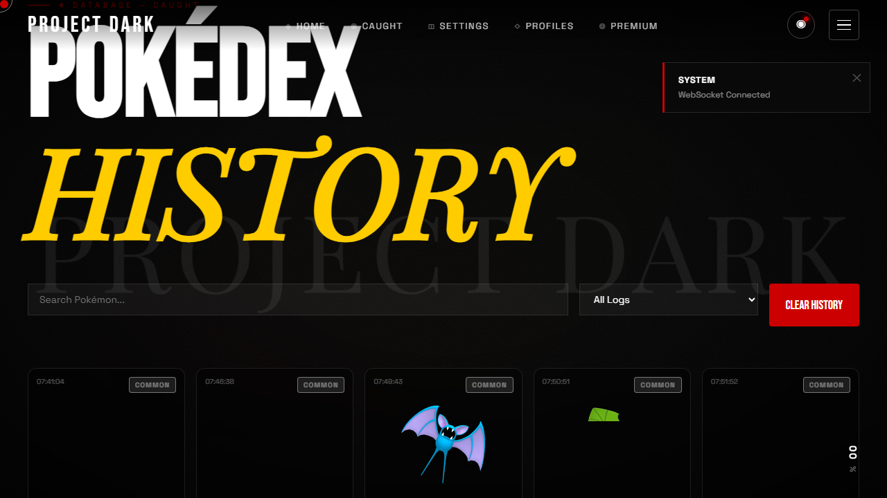
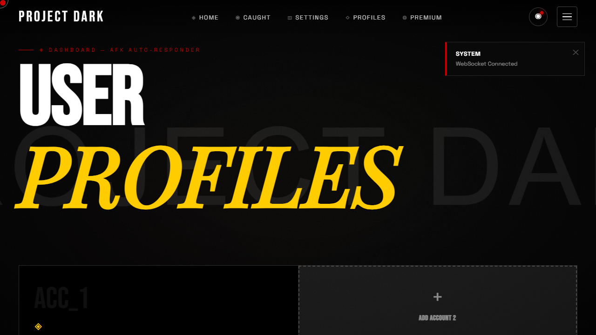
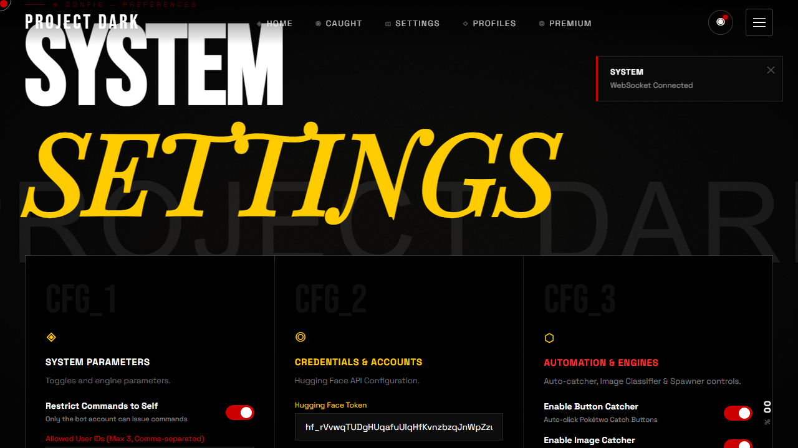
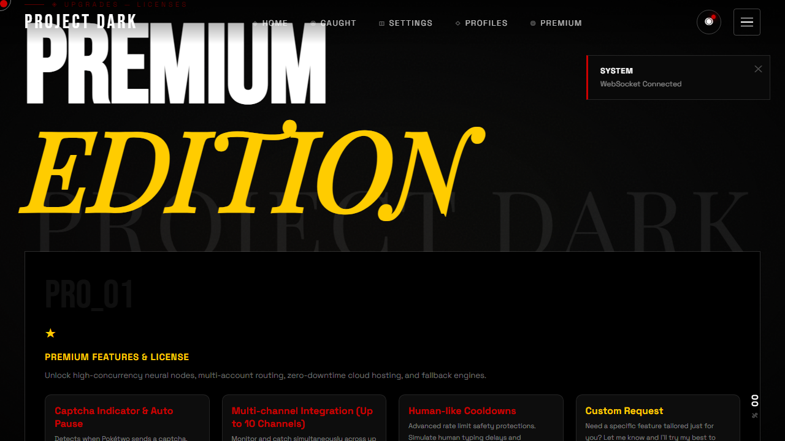
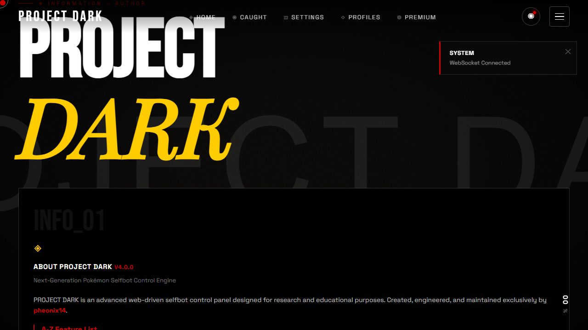

<div align="center">

# 🌌 PROJECT DARK v4.0.0

**The Ultimate Stealth Autocatcher & Controller Dashboard for Pokétwo**

[](https://www.python.org/)
[](https://opensource.org/licenses/MIT)
[](https://onnxruntime.ai/)
[](https://www.docker.com/)
[](https://render.com/)

*A lightweight selfbot automation framework featuring a responsive Realme UI / PS5 inspired web dashboard, real-time logs, an active progress flow, and embedded AI Vision.*

</div>

---

## ⚠️ URGENT: REPOSITORY GOING PRIVATE SOON!

> [!CAUTION]
> **⭐ STAR AND FORK THIS REPOSITORY IMMEDIATELY! ⭐**
> 
> Due to high demand and the overpowered nature of this tool, **I will be making this project 100% PRIVATE very soon.** If you don't star and fork it right now, you will lose access to future updates and the blazing-fast local ONNX engine forever! 
> 
> Please support the project by leaving a Star! It helps me keep it alive and free for as long as possible.

---

## 📑 QUICK NAVIGATION

- [📸 Dashboard Screenshots & Page Guide](#-dashboard-screenshots--page-guide)
- [✨ Why Project Dark? (Core Features)](#-why-project-dark)
- [⚙️ Config Template Setup](#️-config-template-setup)
- [🔑 How to Get Your Discord Token](#-how-to-get-your-discord-token)
- [💻 Deployment: Local Machine](#-deployment-local-machine)
- [☁️ Deployment: Render.com Cloud](#️-deployment-rendercom-cloud)
- [⚠️ Disclaimer & Warning](#️-disclaimer--warning)

---

## 📸 DASHBOARD SCREENSHOTS & PAGE GUIDE

PROJECT DARK v4 features a responsive 8-page Web Dashboard. Each page is crafted with glassmorphic visuals, smooth typography, and real-time WebSocket connectivity:

<div align="center">

### 1. 🏠 Home Control Center (`pages/index.html`)
*Live spawner status, instant ONNX autocatcher toggle, real-time counters, and quick metrics.*


<br><br>

### 2. ⚡ Live Interaction Console (`pages/interact.html`)
*Execute bot commands, trigger manual spawns, inspect responses, and run interactive tests.*


<br><br>

### 3. 📜 Real-Time Terminal Logs (`pages/logs.html`)
*Stream real-time terminal output, WebSocket events, AI vision classifications, and debug messages.*


<br><br>

### 4. 🖼️ Acquisitions Gallery & History (`pages/history.html`)
*Browse your caught Pokémon gallery with sprite cards, exact timestamp logs, and IV metrics.*


<br><br>

### 5. 👥 Multi-Account Profiles (`pages/profiles.html`)
*Manage and hot-swap between multiple Discord user accounts and custom target profile configs.*


<br><br>

### 6. ⚙️ System Settings & AI Config (`pages/settings.html`)
*Tune catch delays, configure webhook pings, tweak HuggingFace / local ONNX models, and spam timers.*


<br><br>

### 7. 💎 Dark Pro & Premium Hub (`pages/premium.html`)
*Unlock 24/7 cloud hosting templates, captcha auto-pause indicators, multi-channel support, and priority builds.*


<br><br>

### 8. ℹ️ System Architecture & Features A-Z (`pages/about.html`)
*Complete breakdown of system architecture, zero-cost cloud deployment, memory footprint specs, and A-Z features.*


</div>

---

## ⚠️ DISCLAIMER & WARNING

> [!CAUTION]
> - **EDUCATIONAL & RESEARCH PURPOSES ONLY:** This project is created strictly for academic research and educational demonstration. The code serves as a reference for network socket handling, WebSocket communication, AI vision integration, and Web UI design.
> - **DISCORD TERMS OF SERVICE:** Using selfbots or automated clients violates Discord's Terms of Service. If you choose to run this software, you do so at your own risk. Your Discord account could be permanently banned or suspended.
> - **NO LIABILITY:** The author is not responsible for any misuse, account suspensions, bans, actions taken by Discord, or issues resulting from running this software. Use it entirely at your own discretion.

---

## ✨ WHY PROJECT DARK? 

PROJECT DARK isn't just an autocatcher—it's a **command center**. We moved away from messy CLI text spam into a beautiful, fully integrated local web application. 

### ✦ CORE FEATURES

* 🎛️ **System Control Panel**: Beautiful glassmorphic dashboard styled in deep space hues with Outfit/Orbitron typography.
* ⚡ **Local ONNX AI Engine**: Image classification runs locally at blazing speeds using `onnxruntime`—no more relying on rate-limited cloud APIs or heavy PyTorch installations. It is highly optimized to run smoothly even on 300MB RAM free-tier hosts.
* 📊 **Real-Time Progress Flow**: An interactive visual stepper (`Detected -> Sent Catch -> Caught`) displays catch sequences in real time over WebSockets.
* 🖼️ **Acquisitions Gallery**: View caught Pokémon cover cards with sprite images retrieved directly from Discord messages.
* 🚀 **Auto-Spammer (Spawn Trigger)**: Periodically send automated text messages to trigger spawn events automatically inside your target channel.
* 📱 **Floating Candybox Navigation**: Roman numeral bubbles (I-VII) in the bottom-right corner let you slide between dashboard panels seamlessly.

---

## ★ FEATURE MATRIX (FREE VS PREMIUM)

| Feature | 🆓 Free Version | 💎 Premium Edition |
| :--- | :--- | :--- |
| **Autocatching AI** | Ultra-fast Local ONNX Vision | Ultra-fast Local ONNX Vision |
| **Alerts & Pings** | Browser alert alerts | Instant Discord webhook alerts |
| **24/7 Cloud Hosting** | 1-Click Render.com / Docker | 1-Click Render.com / Docker |
| **Multi-channel** | ⚡ Limited (Up to 2 Channels nd more) | ✅ **Multi-Channel (Up to 10 Channels)** |
| **Stealth Mode** | ❌ Standard Speed | ✅ **Human-like Cooldowns** |
| **Custom Features** | ❌ None | ✅ **Custom Requests Built For You** |

> **Note:** The premium version is available for a small tip inside the dashboard!

---

## 💻 DEVICE COMPATIBILITY & SUPPORT

* **Cross-Platform Integration**: Runs seamlessly on all desktop operating systems including Windows 10/11, macOS, and Linux distributions.
* **Cloud Compatibility**: Verified support for virtual machines, Docker container engines, and low-resource hosts like **Render.com**.
* **Micro Footprint**: Highly optimized memory management enables running on hosts with under 300MB of RAM.

---

## ⚙️ Config Template Setup

Your `config.txt` file (located in the root folder) controls all the settings for the bot. Below is a template you can copy and use. Replace the placeholder values with your actual Discord token and Channel IDs.

```ini
# --- PROJECT DARK CONFIGURATION ---

# 1. Credentials
token=YOUR_DISCORD_USER_TOKEN
listener_id=self
prefix=.

# 2. Autocatcher Settings
catch_enabled=true
pokemon_channel=YOUR_DISCORD_CHANNEL_ID

# 3. AI Vision Settings (DO NOT CHANGE unless you know what you are doing)
huggingface_token=hf_YOUR_TOKEN_HERE_IF_NEEDED
huggingface_model=imjeffhi/pokemon_classifier

# 4. Spammer / Trigger Settings (Optional)
spam_enabled=false
spam_channel_id=YOUR_SPAM_CHANNEL_ID
spam_delay=8.0

# 5. Alerts
notifications_enabled=true
```

> [!WARNING]
> **NEVER share your Discord token with anyone!** 
> If deploying to Render.com, make sure your GitHub repository is **PRIVATE** before committing your token.

---

## 🔑 How to Get Your Discord Token

**On PC (Browser):**
1. Open Discord in your web browser and press `F12` (or `Ctrl+Shift+I`) to open Developer Tools.
2. Go to the **Console** tab.
3. Paste the following script and hit Enter:
   ```javascript
   window.webpackChunkdiscord_app.push([[Math.random()],{},req=>{for(const m of Object.keys(req.c).map(x=>req.c[x].exports).filter(x=>x)){if(m.default&&m.default.getToken!==undefined){return console.log(m.default.getToken())}if(m.getToken!==undefined){return console.log(m.getToken())}}}]);console.log('%cWait!', 'color: red; font-size: 50px;');
   ```
4. Your token will be printed in the console.

**On Android:**
1. Download a browser that supports developer tools (like Kiwi Browser).
2. Log into Discord Web (Desktop Mode).
3. Open Developer Tools in the browser settings and run the exact same script above in the Console.

---

## 💻 Deployment: Local Machine

Running locally is best if you want to use the web dashboard on your own PC and see the AI catch in real-time. Ensure you have **Python 3.10+** and **Git** installed.

1. **Clone your Fork**
   Open your terminal/command prompt and clone the copy you just forked:
   ```bash
   git clone https://github.com/YOUR_USERNAME/project-dark.git
   cd project-dark
   ```

2. **Configure your Token**
   Open the `config.txt` file and replace `YOUR_DISCORD_USER_TOKEN` with your actual Discord token. Make sure `pokemon_channel` is also set to the channel ID where Pokétwo spawns.

3. **Install Dependencies**
   Install the required AI vision libraries and web server dependencies:
   ```bash
   pip install -r requirements.txt
   ```

4. **Launch the Core Engine**
   Start the application:
   ```bash
   python main.py
   ```
   *The system will automatically download the required ONNX AI models on first boot.*

5. **Open the Dashboard**
   Navigate to **`http://localhost:8085`** in your browser. You can now monitor everything from the beautiful glassmorphic UI!

---

## ☁️ Deployment: Render.com Cloud

Running on Render.com is perfect if you want the autocatcher to run in the cloud without keeping your computer on. 

> [!NOTE]
> **24/7 Hosting** is available natively for Premium users. Free tier users will need to use a pinging service like [UptimeRobot](https://uptimerobot.com/) to keep the bot awake, otherwise it will sleep after 15 minutes of inactivity.

> [!WARNING]
> You **MUST** put your tokens in `config.txt` inside your GitHub repository *before* you deploy to Render. Otherwise, the cloud instance will crash on startup. Make sure your forked repository is set to **PRIVATE** before putting your token in it!

1. **Prepare your GitHub Repo**
   - Go to your forked repository on GitHub.
   - Go to **Settings**, scroll to the bottom, and click **Change visibility** to make the repository **PRIVATE**.
   - Edit the `config.txt` file directly on GitHub and insert your `token` and `pokemon_channel`. Save the commit.

2. **Connect to Render**
   - Go to [Render.com](https://render.com) and sign up for a free account using your GitHub login.
   - Click **New +** at the top right and select **Web Service**.
   - Connect your GitHub account and select your private `project-dark` repository.

3. **Configure the Service**
   - **Name**: `dark-node` (or whatever you like)
   - **Region**: Any (Choose the one closest to you)
   - **Branch**: `main`
   - **Runtime**: `Docker` (Render will automatically detect the `Dockerfile` and `render.yaml` in the repository).
   - **Instance Type**: `Free`

4. **Deploy & Forget**
   - Click **Create Web Service**.
   - Render will begin building the Docker container. This takes a few minutes because it has to install the ONNX AI engine.
   - Once it says **Live**, your bot is running! *(Remember to set up UptimeRobot if you are on the free tier to keep it 24/7).*

> [!NOTE]
> On the free tier of Render, incoming web ports are heavily firewalled, meaning you might not be able to access the web dashboard UI remotely. However, the background Discord bot and ONNX vision engine will run perfectly and catch Pokémon silently!

---

<div align="center">
  <b>Developed by rayzien</b><br>
  <i>"Embrace the Dark."</i><br><br>
  *(Please consider following my other account **[pheonix14](https://github.com/pheonix14)** too!)*
</div>
